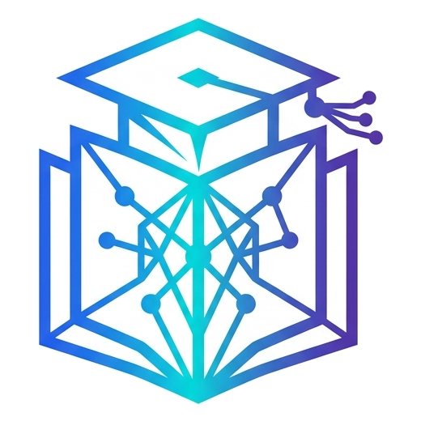

# 🎓 Academic Hub

<p align="center">
  
</p>

<p align="center">
  <strong>Sistem Manajemen Perkuliahan Modern, Arsip Berkas Materi, & Pengingat Deadline Tugas Otomatis</strong>
</p>

<p align="center">
  
  
  
  
  
  
  
</p>

---

## 🌟 Tentang Academic Hub

**Academic Hub** adalah aplikasi web komprehensif yang dirancang khusus untuk mahasiswa agar dapat mengelola seluruh aktivitas perkuliahan dalam satu platform terpadu. Mulai dari pencatatan mata kuliah, pengarsipan berkas materi per pertemuan, hingga pelacakan deadline tugas dengan sistem pengingat otomatis (*automated reminder*) yang terkirim langsung ke akun **Telegram** dan **WhatsApp** mahasiswa.

---

## ✨ Fitur Utama

### 🌓 1. Dual Theme (Light & Dark Mode)
- **Desain Modern & Responsif**: Tampilan ramah mata dengan peralihan tema yang mulus.
- **Anti-FOUC (Flash of Unstyled Content)**: Tidak ada efek kedip putih saat memuat ulang halaman.
- **Deteksi Preferensi Otomatis**: Mendukung sinkronisasi dengan preferensi tema sistem peramban/OS pengguna.

### 📚 2. Manajemen Mata Kuliah (Courses)
- Tambah, edit, dan hapus mata kuliah dengan metadata lengkap (Kode Matkul, Nama, SKS, Dosen Pengampu, Ruang Kelas, Semester).
- Pencarian cerdas dan filter mata kuliah berdasarkan semester atau hari kuliah.
- Kartu ringkasan statistik (Total Matkul, Tugas Aktif, Materi Diunggah).

### 📑 3. Arsip Berkas & Materi Kuliah (Materials)
- **Multi-Format Upload**: Mendukung dokumen (`PDF`, `DOCX`, `PPTX`, `XLSX`, `TXT`) dan gambar (`JPG`, `PNG`, `WEBP`, `JPEG`).
- **Filter & Pengurutan Berkas**: Filter materi berdasarkan ekstensi format dan nomor pertemuan kuliah (Pertemuan 1 - 16).
- **In-Browser File Previewer**: Lihat langsung isi berkas dokumen PDF dan gambar di dalam aplikasi tanpa perlu mengunduhnya terlebih dahulu.
- **Edit & Unduh Berkas**: Ubah nama materi dan nomor pertemuan kapan saja dengan mudah.
- **Pembersihan Berkas Otomatis**: Saat materi atau mata kuliah dihapus, berkas fisik pada penyimpanan disk otomatis dibersihkan.

### ⏰ 4. Pelacak Tugas & Indikator Deadline (Assignments)
- **Indikator Urgensi Dinamis**:
  - 🔴 **Merah**: Deadline kurang dari 24 jam.
  - 🟡 **Kuning**: Deadline kurang dari 3 hari.
  - 🟢 **Hijau**: Deadline lebih dari 3 hari.
- **Pengubah Status Interaktif**: Tandai tugas selesai atau kembalikan ke aktif dalam satu kali klik.
- **Riwayat Tugas Selesai**: Bagian tugas selesai dapat diciutkan (*collapsible*) agar tampilan tetap rapi dan fokus.

### 🤖 5. Multi-Channel Notification Gateway
- **Bot Telegram Otomatis (100% Gratis)**:
  - Notifikasi pengingat otomatis dikirimkan terjadwal (H-3, H-1, dan Hari H).
  - Panduan integrasi bot interaktif di halaman Profil Pengguna.
- **Dukungan WhatsApp**: Opsi integrasi pesan WhatsApp via Green-API atau self-hosted WAHA.

### 🛡️ 6. Keamanan & Performa
- **Isolasi Data Pengguna**: Diterapkan *Eloquent Authorization Policy* sehingga setiap mahasiswa hanya dapat melihat dan mengelola datanya sendiri.
- **Pencegahan XSS Berkas**: Validasi unggahan berkas ketat dan pemblokiran berkas SVG berbahaya.
- **Endpoint File Terlindungi**: Seluruh unduhan dan pratinjau materi diverifikasi hak aksesnya sebelum berkas disajikan.

---

## 🛠️ Tech Stack

| Lapisan | Teknologi |
| :--- | :--- |
| **Backend Framework** | [Laravel 11 / 12](https://laravel.com) (PHP 8.2+) |
| **Frontend Framework** | [React 18](https://react.dev) + [Inertia.js v2](https://inertiajs.com) |
| **Styling & UI** | [Tailwind CSS v3](https://tailwindcss.com), [Lucide React](https://lucide.dev) |
| **Database** | PostgreSQL ([Supabase](https://supabase.com)) / SQLite / MySQL |
| **Penyimpanan Berkas** | Local Filesystem / [Cloudflare R2](https://www.cloudflare.com/developer-platform/r2/) (S3-compatible) |
| **Pengujian** | PHPUnit (57 tests, 100% lulus) |

---

## 🚀 Panduan Instalasi Lokal

Ikuti langkah-langkah berikut untuk menjalankan Academic Hub di komputer lokal Anda:

### 1. Prasyarat Sistem
- PHP >= 8.2 (dengan ekstensi `pdo`, `mbstring`, `fileinfo`, `openssl`, `curl`)
- [Composer](https://getcomposer.org/)
- [Node.js](https://nodejs.org/) (Versi 18 atau lebih baru) & NPM

### 2. Kloning Repositori
```bash
git clone https://github.com/<username-anda>/<nama-repo>.git
cd <nama-repo>
```

### 3. Pasang Dependensi
```bash
# Dependensi PHP
composer install

# Dependensi Frontend JavaScript
npm install
```

### 4. Konfigurasi Environment (`.env`)
Salin berkas contoh environment dan buat *Application Key*:
```bash
cp .env.example .env
php artisan key:generate
```

Buka berkas `.env` lalu sesuaikan konfigurasi database Anda. Untuk database lokal SQLite sederhana:
```ini
DB_CONNECTION=sqlite
```
*(Atau arahkan ke PostgreSQL / Supabase sesuai kebutuhan Anda).*

### 5. Jalankan Migrasi Database
```bash
php artisan migrate
```

### 6. Buat Symlink Storage
Untuk mengizinkan akses ke berkas materi yang diunggah secara lokal:
```bash
php artisan storage:link
```

### 7. Pengaturan Bot Telegram (Opsional tapi Direkomendasikan)
1. Buka Telegram dan hubungi [@BotFather](https://t.me/BotFather).
2. Kirim perintah `/newbot` dan ikuti langkah pembuatan bot hingga mendapatkan **Bot Token**.
3. Masukkan token tersebut ke dalam berkas `.env`:
   ```ini
   TELEGRAM_BOT_TOKEN=123456789:ABCdefGhIJKlmNoPQRstuVWXyz
   TELEGRAM_BOT_USERNAME=NamaBotAnda_bot
   ```

### 8. Jalankan Server Pengembangan
Jalankan server aplikasi dan Vite:
```bash
# Terminal 1: Backend Server
php artisan serve

# Terminal 2: Frontend Asset Bundler
npm run dev

# Terminal 3 (Opsional): Background Task Scheduler
php artisan schedule:work
```

Buka peramban Anda di: **`http://localhost:8000`**

---

## 🧪 Menjalankan Pengujian (Testing)

Proyek ini telah dilengkapi dengan 57 unit & feature tests mencakup autentikasi, manajemen matkul, unggah/unduh/pratinjau materi, keamanan berkas, serta verifikasi pengingat otomatis.

```bash
php artisan test
```

---

## ☁️ Rekomendasi Deployment Produksi (100% Gratis)

Academic Hub dapat di-deploy jangka panjang tanpa biaya menggunakan salah satu arsitektur berikut:

1. **Oracle Cloud "Always Free" VPS (Paling Direkomendasikan)**:
   - Gratis permanen selamanya (hingga 24GB RAM, 200GB disk).
   - Menjalankan Nginx, PHP 8.2, native cron scheduler, dan penyimpanan lokal yang stabil.
2. **Kombinasi Cloud Free-Tier**:
   - **Web App**: [Render.com](https://render.com) atau [Koyeb](https://koyeb.com) (via Dockerfile).
   - **Database**: [Supabase](https://supabase.com) (500 MB PostgreSQL gratis).
   - **File Storage**: [Cloudflare R2](https://www.cloudflare.com/products/r2/) (10 GB S3-compatible gratis tanpa biaya egress).
   - **Cron Trigger**: [cron-job.org](https://cron-job.org) untuk memanggil scheduler pengingat tugas.

---

## 📄 Lisensi

Academic Hub dirilis di bawah lisensi [MIT License](LICENSE). Bebas digunakan dan dikembangkan untuk keperluan akademik maupun pribadi.
